# ДЗ 4. Обучение Stable diffusion 1.5 методом Dreambooth

## Сбор датасета для персонажа

Собрал и подготовил 26 изображений

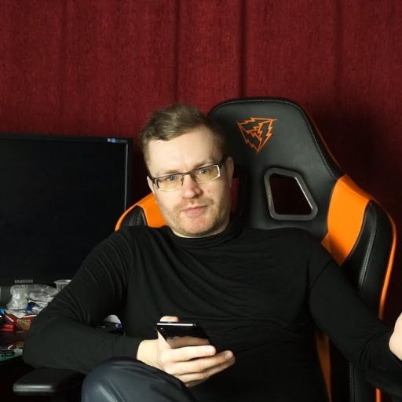
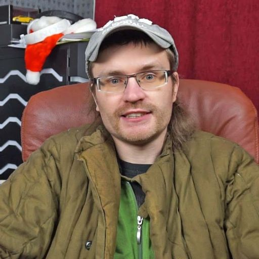
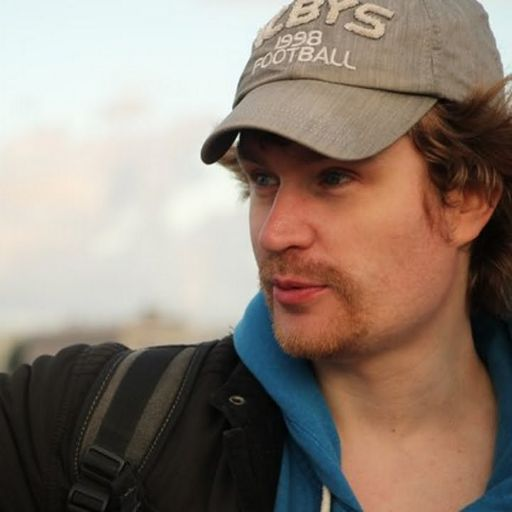

## Обучение Stable Diffusion 1.5

Вышло довольно неплохо, на персонажа довольно похоже

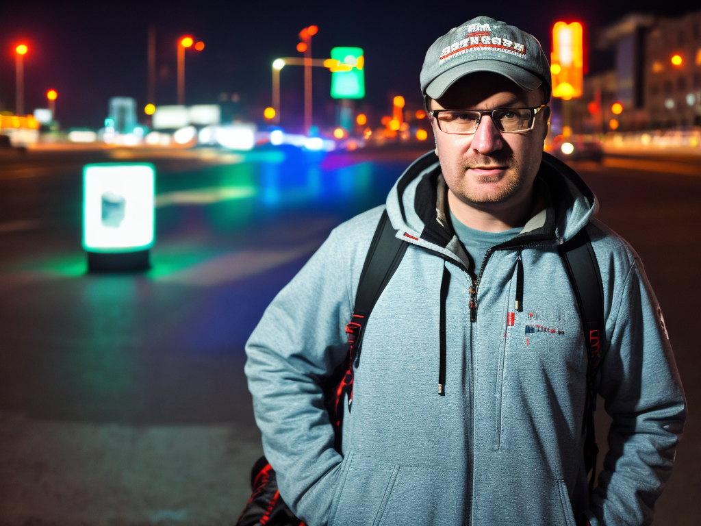
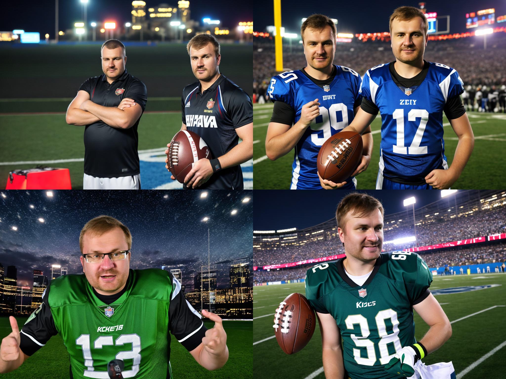

## Обучение LoRA

Поэксперементировал я много. Ниже представленны некоторые из экспериментов. Для всех экспериментов есть результаты генерации в ./report_images

### Rank=64, lr=2e-4, batch_size=3

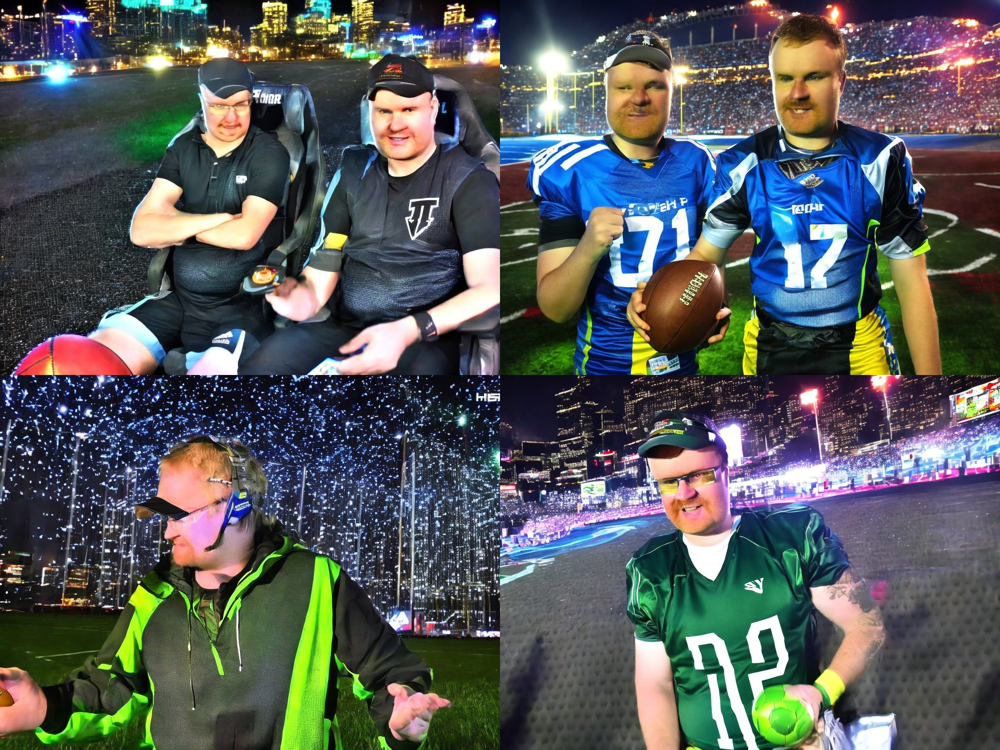
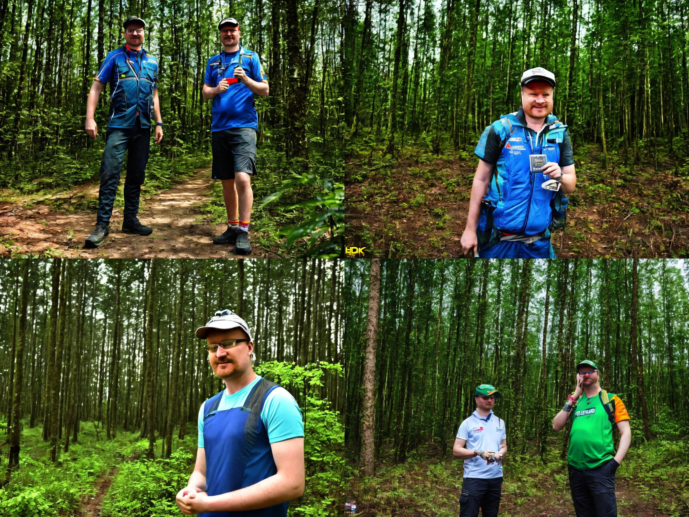

### Rank=8, lr=5e-4, batch_size=3

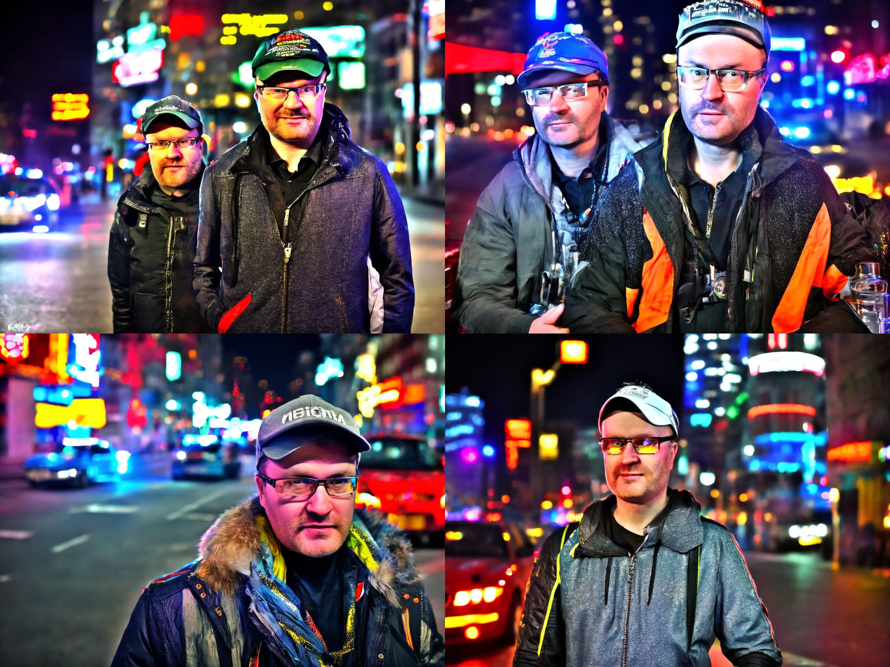
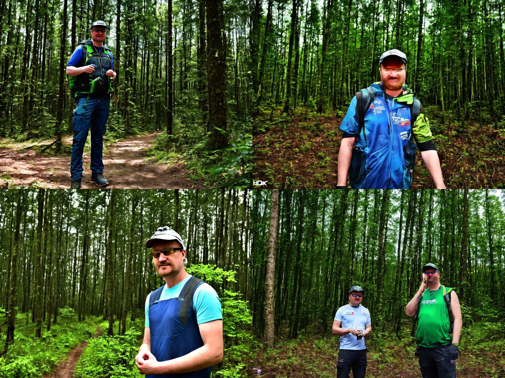

## ControlNet

### Stable Diffusion 1.5

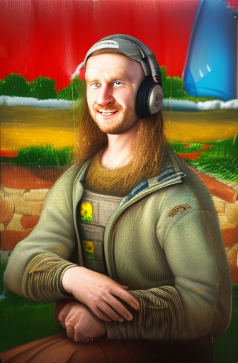
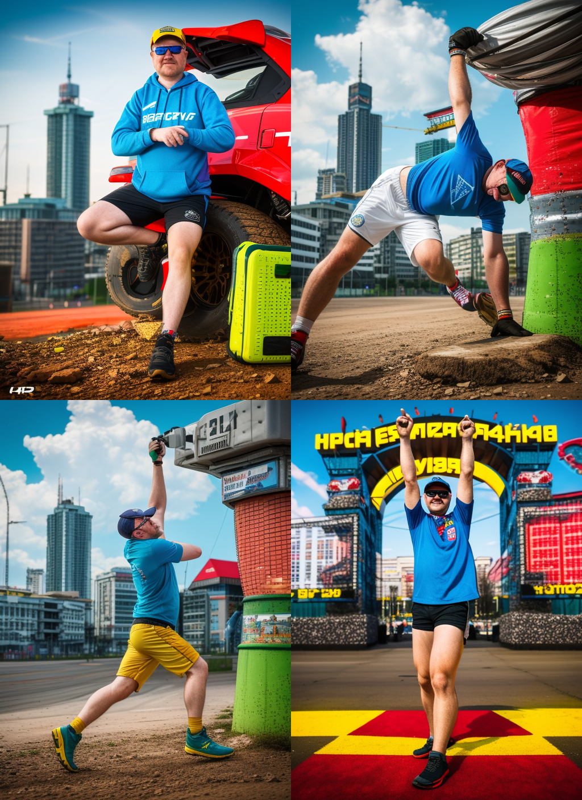

### LoRA Rank=64

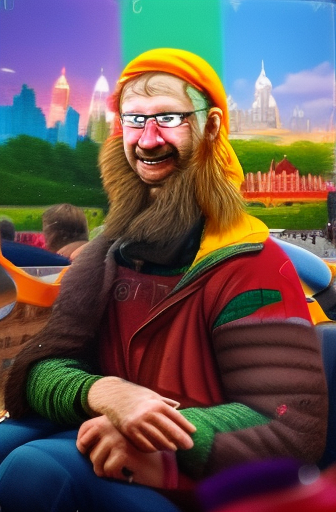
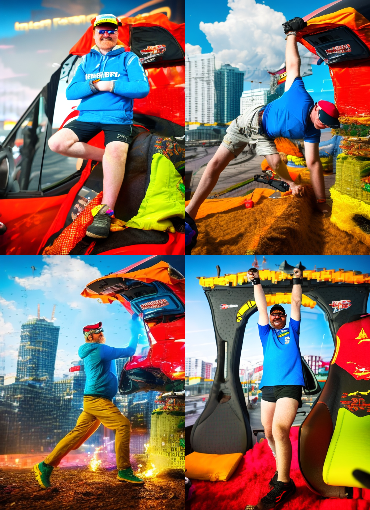
