# 2024 ITMO "Deep Generative models" course homework #1

ФИО: Иванов Пётр Алексеевич (в прошлом семестре был на курсе "Обработка и генерации изображений")

## MLE Generated avatars (./generated_avatars)

### Polynomial model

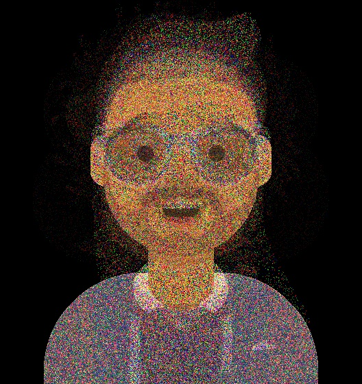
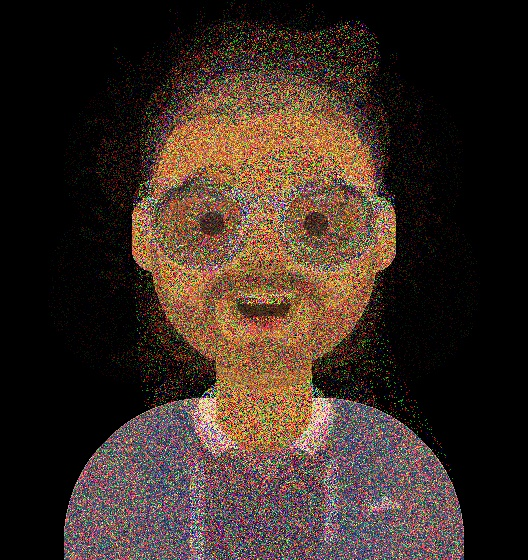
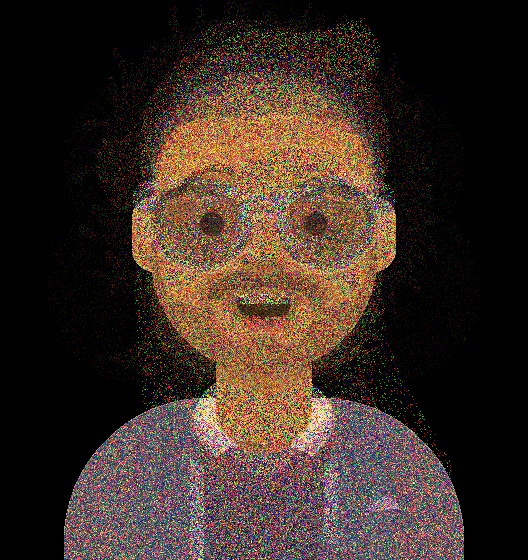
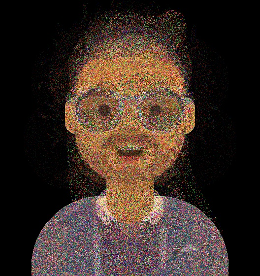
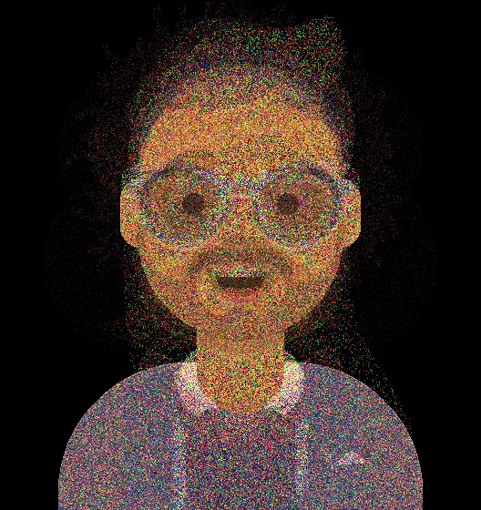

### Additive smoothing
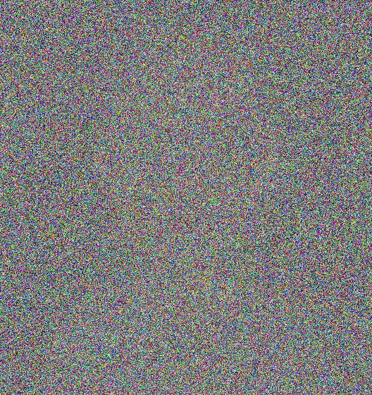
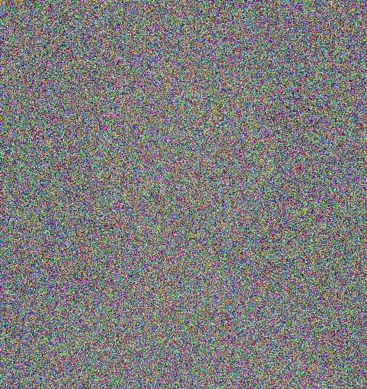
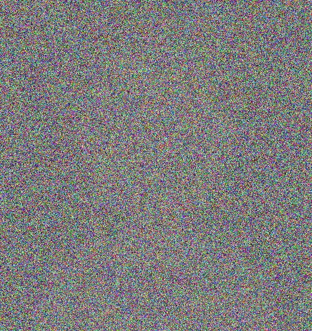
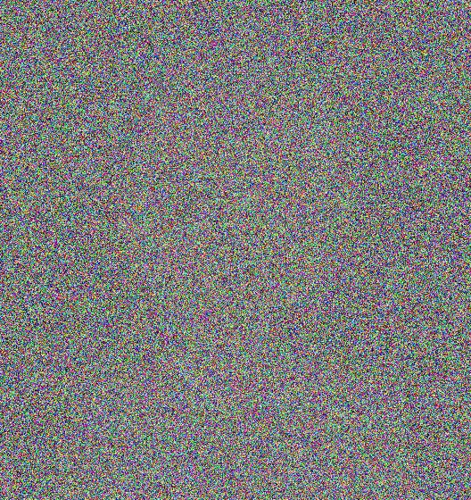
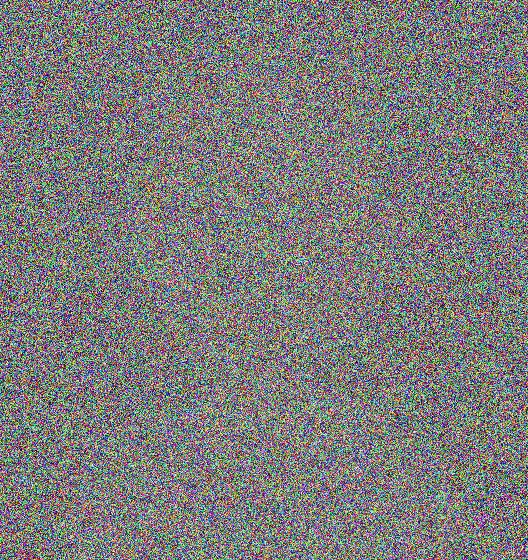

## Unsupervised anomaly detection w/ MNAD

[MNAD paper](https://openaccess.thecvf.com/content_CVPR_2020/papers/Park_Learning_Memory-Guided_Normality_for_Anomaly_Detection_CVPR_2020_paper.pdf)
[MNAD repository](https://github.com/cvlab-yonsei/MNAD)

My memory implementation might differ a little from official MNAD implementation. However, it is based on MNAD paper and official repository. I've used all the loss functions as MNAD paper suggested (reconstruction, compactness and separatness loss)

I've tried to estimate loss threshold twice: for train data (red line) and for test data (green line). As we can see, train estimated threshold is close to optimal

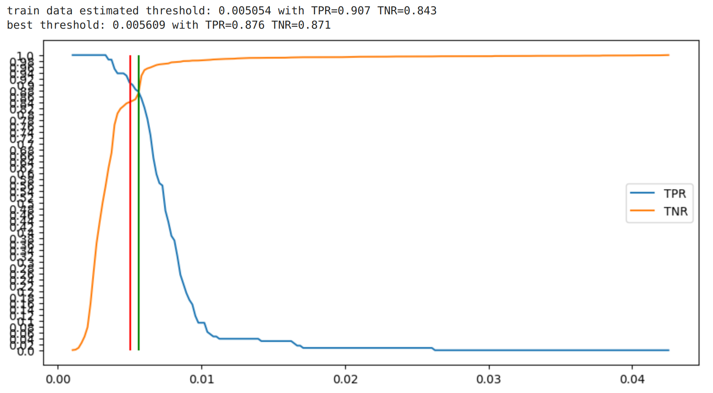

Latent space visualization with PCA, SVD and t-SNE decomposition. PCA and t-SNE show separability.

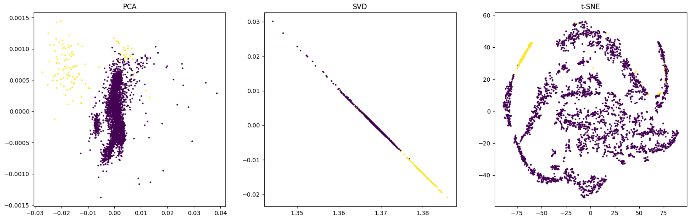
