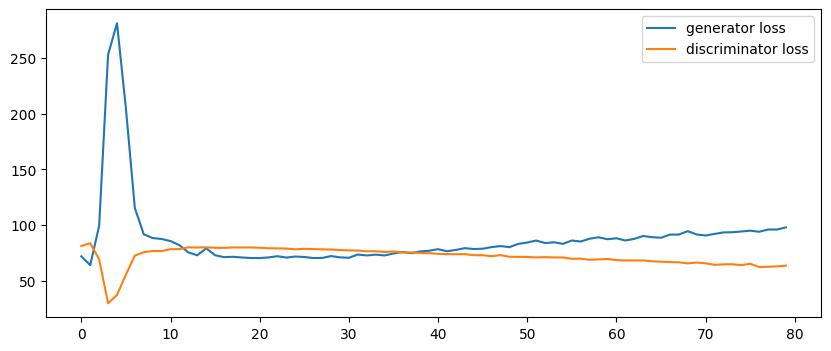
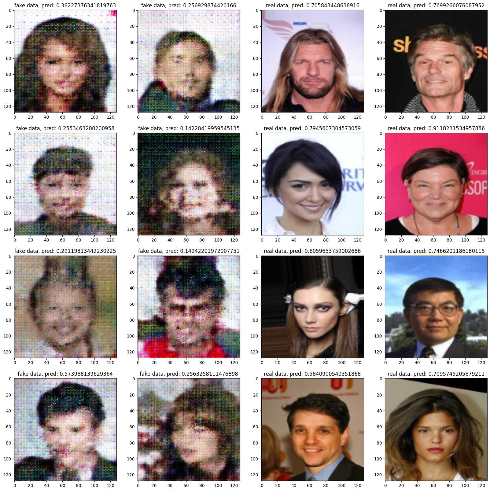

# 2024 ITMO "Deep Generative models" course homework #2

ФИО: Иванов Пётр Алексеевич (в прошлом семестре был на курсе "Обработка и генерации изображений")

## Лог основных экспериментов

0. Gscale=0.5 Dscale=0.5 batch=1536 epochs=100
1. Gscale=1 Dscale=1 batch=512 коллапс на 40й эпохе
2. Gscale=1 Dscale=1 batch=512 добавил функций активации и батч-нормализации
3. Gscale=1 Dscale=0.5 batch=768 немного изменил размерности в CSPup + добавил дополнительный forward pass для генератора

## Результаты наиболее удачного эксперимента

## Краткий список того, что я сделал ради сходимости:

1. Модифицировал CSPup блоки за счет добавления дополнительных функций активации и батч-нормализаций
2. Использовал довольно большой размер батча (768). Это очень сильно стабилизировало обучение, при размере батча 256 все было не так гладко.
3. Использовал label_smoothing чтобы поверхность ФП для дискриминатора была "помягче"
4. НЕ использовал полносвязные слои (где-то читал, что это помогает)
5. Подобрал параметры для оптимизаторов (D lr=0.0002, betas=(0.5, 0.999), G lr=0.001, betas=(0.5, 0.999)). Дискриминатору обучаемость ограничил за счет lr, обоим оптимизаторам уменьшил первую бету чтобы было меньше коллапсов (за счет уменьшения первого момента алгоритм оптимизации может выбраться из состояния коллапса).
6. Вместо ReLU на выходе генератора использовал tanh (это из предыдущего опыта взял), соответственно и данные отскейлил в [-1, 1]
7. Train loop я взял из своей работы по детекции аномалий на ганах из курса "Обработка и генерация изображений" (но и его потом немного поменял: добавил дополнительный forward pass для генератора после обновления весов дискриминатора)

